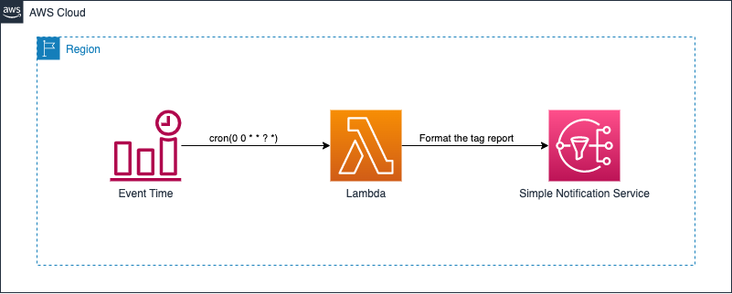

# Daily Tag Report Email

The purpose of this template is to create a set of AWS resources that generate a daily tag report and send it to a specified email address.

## Key Components

- LambdaExecutionRole: An IAM role with permissions to access EC2 and SNS services.
- DailyTagReportLambda: A Lambda function that generates the tag report.

## Parameters

- EmailAddress: The email address to receive the tag report.

## Prerequisites

- SNSTopicArn: An SNS Topic that will receive the tag report and send it to the specified email address.

## Usage

1. Open the AWS CloudFormation console.
1. Create a new stack and upload the stack.yml file.
1. Enter the desired email address in the EmailAddress parameter.
1. Click on the "Create stack" button to deploy the resources.
1. Obtain the ARN of the SNS topic created earlier.
1. Modify the code of the Lambda function, specifically the TopicDailyTagLambdaSNS value to include the ARN obtained.
1. Save, Deploy, Test and Enjoy.

## Supported Resources

- EC2
- Security Group
- Volume
- Key Pair
- Load Balancer

[Boto3 Documentation 1.26.63](https://boto3.amazonaws.com/v1/documentation/api/latest/reference/services/ec2.html#client)

## Note

The AWS region is set to `us-east-1` in the template, if you want to deploy in another region you need to modify the template accordingly.

## Security

See [CONTRIBUTING](CONTRIBUTING.md#security-issue-notifications) for more information.

## License

This library is licensed under the MIT-0 License. See the LICENSE file.